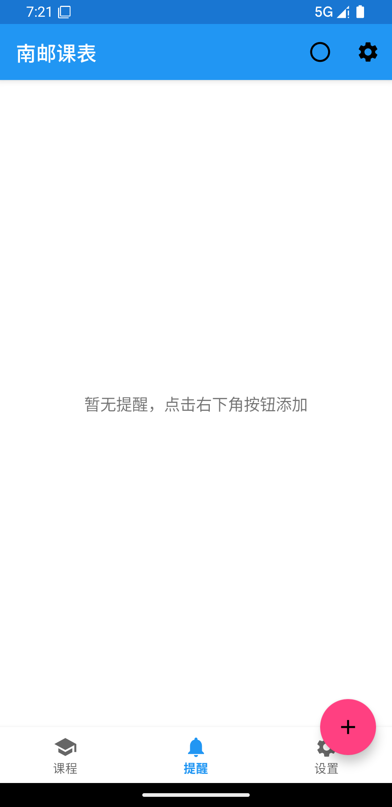

# 南京邮电大学课程表系统

一个基于Spring Boot后端 + Android前端的课程表管理应用，专为大三电子信息工程专业设计。



## ✨ 功能特性

- 📅 **18周完整课程表**
  - 真实的电子信息专业课程（16种）
  - 按周、按天展示课程
  - 支持课程详情查看

- ⏰ **智能课程提醒**
  - 添加/删除课程提醒
  - 自动计算下次上课时间
  - 提醒列表管理

- 🎯 **真实数据**
  - 200+门课程
  - 14位教师
  - 14个教室
  - 自动数据初始化

## 🚀 快速开始

### 对于新成员

**只需3步即可获得完整的模拟数据：**

```bash
# 1. 创建数据库
mysql -u root -p < server/src/main/resources/db/setup.sql

# 2. 修改数据库密码
# 编辑 server/src/main/resources/application.properties
# 修改 spring.datasource.password=你的密码

# 3. 启动服务器（自动生成所有数据）
cd server
mvn spring-boot:run
```

**就这么简单！** 🎉

详细步骤请查看 [SETUP.md](./SETUP.md)

## 📋 前置要求

- Java 11+
- Maven 3.6+
- MySQL 8.0+
- Android Studio Arctic Fox+

## 🏗️ 项目结构

```
njupt_courseTable/
├── app/                           # Android客户端
│   └── src/main/java/.../
│       ├── data/                  # 数据层
│       │   ├── model/            # 数据模型
│       │   ├── remote/           # API服务
│       │   └── repository/       # 数据仓库
│       └── ui/                    # UI层
│           ├── activity/         # 活动
│           ├── adapter/          # 适配器
│           └── view/             # 自定义视图
│
├── server/                        # Spring Boot后端
│   └── src/main/java/.../
│       ├── config/               # 配置（含数据初始化）
│       ├── controller/           # REST API控制器
│       ├── model/                # JPA实体
│       └── repository/           # JPA仓库
│
├── diagnose_reminder.sh          # 诊断工具
├── SETUP.md                      # 设置指南
├── CHANGELOG.md                  # 更新日志
└── REMINDER_DEBUG_GUIDE.md       # 调试指南
```

## 🎓 课程数据

### 自动生成的课程（16种）

| 类别 | 课程名称 |
|------|---------|
| **必修课** | 信号与系统、数字信号处理、通信原理、微机原理与接口技术、电磁场与电磁波、高频电子线路、EDA技术、数据通信与计算机网络、嵌入式系统设计 |
| **选修课** | 数字图像处理、专业英语 |
| **实验课** | 数字信号处理实验、通信原理实验、微机原理实验 |
| **实践课** | MATLAB课程设计、C语言程序设计 |

### 数据量
- **18周** 课程
- **200+门** 课程总数
- **14位** 教师
- **14个** 教室

## 🔌 API接口

### 课程相关
- `GET /api/courses/week/{week}` - 获取指定周的课程
- `GET /api/courses` - 获取所有课程
- `POST /api/courses` - 创建课程
- `PUT /api/courses/{id}` - 更新课程
- `DELETE /api/courses/{id}` - 删除课程

### 提醒相关
- `GET /api/reminders/upcoming` - 获取即将到来的提醒
- `POST /api/reminders` - 创建提醒
- `DELETE /api/reminders/{id}` - 删除提醒
- `DELETE /api/reminders/byCourseDate` - 按课程和日期删除

## 🛠️ 开发工具

### 诊断工具
```bash
./diagnose_reminder.sh
```
检查项目：
- ✅ 服务器状态
- ✅ 数据库连接
- ✅ API功能
- ✅ Android配置

### 数据重置
```bash
# 清空数据
mysql -u root -p coursetable -e "DELETE FROM reminders; DELETE FROM courses;"

# 重启服务器自动重新生成
cd server && mvn spring-boot:run
```

## 📱 Android配置

### 模拟器（默认）
```java
BASE_URL = "http://10.0.2.2:8080/"
```

### 真机
```java
BASE_URL = "http://你的电脑IP:8080/"
```

## 📝 开发日志

详见 [CHANGELOG.md](./CHANGELOG.md)

## 🐛 问题排查

遇到问题？
1. 查看 [SETUP.md](./SETUP.md) 的"常见问题"部分
2. 运行 `./diagnose_reminder.sh`
3. 查看 [REMINDER_DEBUG_GUIDE.md](./REMINDER_DEBUG_GUIDE.md)

## 📄 许可证

MIT License

## 👥 贡献

欢迎提交 Issue 和 Pull Request！

---

**重要提示**: 本项目使用自动数据初始化，**无需手动执行SQL脚本**。只需创建数据库，启动服务器即可！
